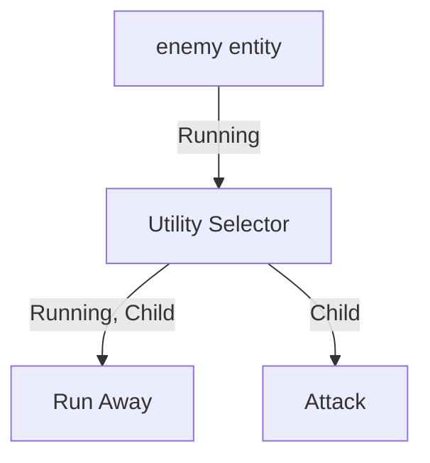

# gamai

### System Ordering


By default there are three system sets:

- `PreNodeUpdateSet`
	- Tick the timer of all `Running` components.
- `NodeUpdateSet`
	- Run the system for all nodes, in parallel.
- `PostNodeUpdateSet`
	- Synchronize all node changes with corresponding props.

### Props


### Multiple Ticks Per Frame

By default all node systems are run in parallel which means that if multiple ticks per render frame are required.
The reccomended approach for multiple ticks per frame is to add the graph systems to a custom schedule that can be run as many times as needed per frame.

- Modular
- No Blackboard

```rs


fn main(){

	let app = 

}


#[derive(Component)]
struct UtilitySelector;

#[action_for(UtilitySelector)]
fn utility_selector(
	selectors: Query<(UtilitySelector,Relations<GamaiChild>)>,
	children: Query<Score>
	){
	for (_, edges) in selectors.iter() {
		let highest_score = 

	}
}
```


## Architecture

`gamai` uses entity relations to define graphs.


The priorities for `gamai` is modularity, parallelism and entity count in that order.
The entity-count complexity is `O(e*n)` where:
- `e` = entities with a given active tree
- `n` = nodes in the tree

Selector nodes and action nodes 

All behavior tree systems can be run in parallel


A future possibility for performace improvement is sub-trees, for instance an enemy may have a `tactic` tree responsible for spawining and despawing `melee` and `ranged` sub-trees, depending on the chosen tactic.


The below graph represents an enemy and its graph. Each of the entities in this graph are repeated for each entity.
